# EcoTrace Business Case - Visualisierungen

## 1. Finanzprojektionen (5 Jahre)

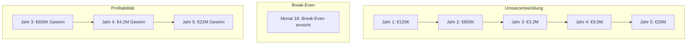

## 2. User Growth Timeline

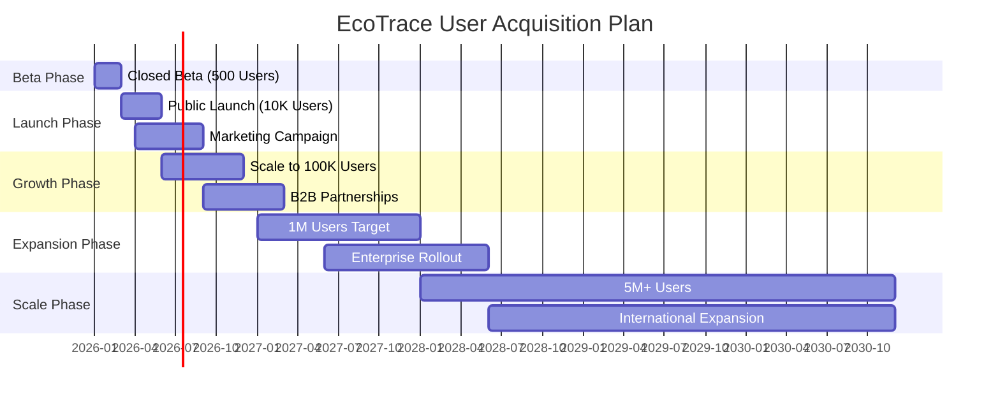

## 3. Marktpositionierung & Wettbewerb

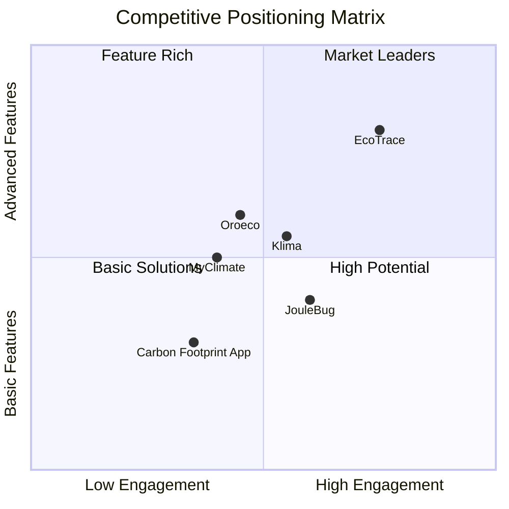

## 4. Revenue Streams Breakdown

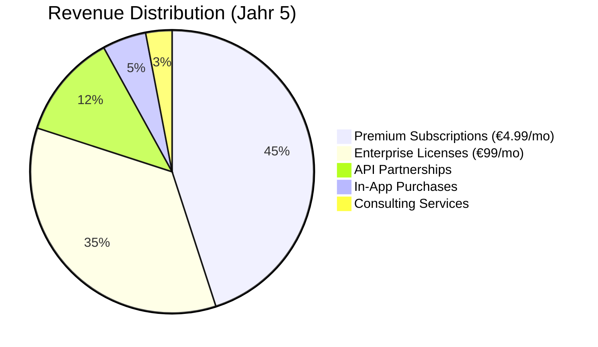

## 5. Technologie-Architektur

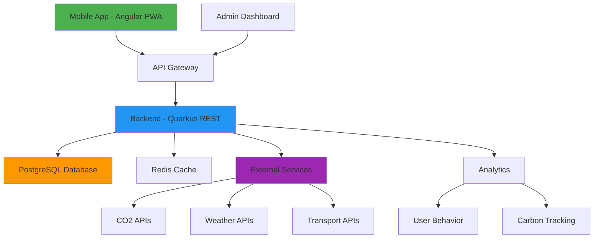

## 6. Go-to-Market Strategie Timeline

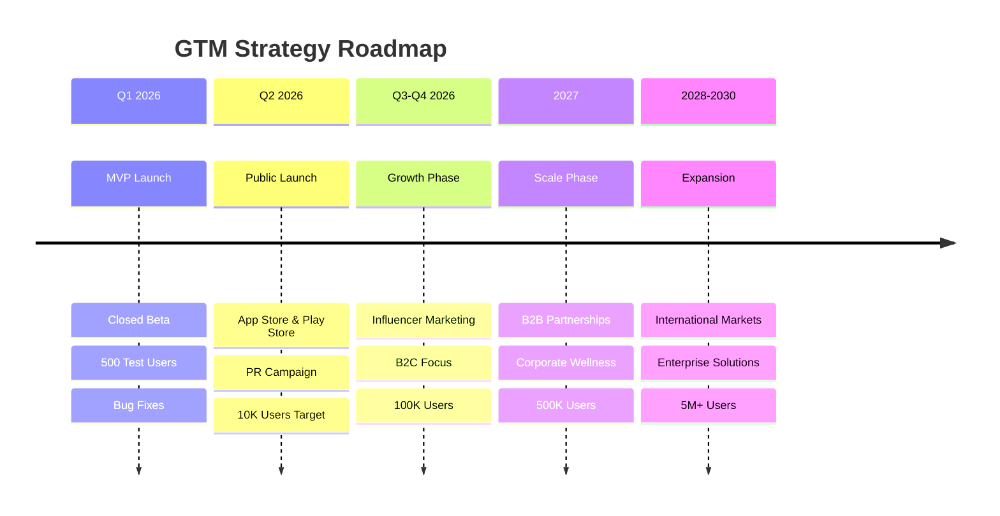

## 7. Funding & Milestones

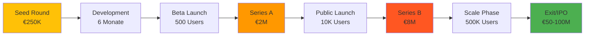

## 8. Feature Rollout Plan

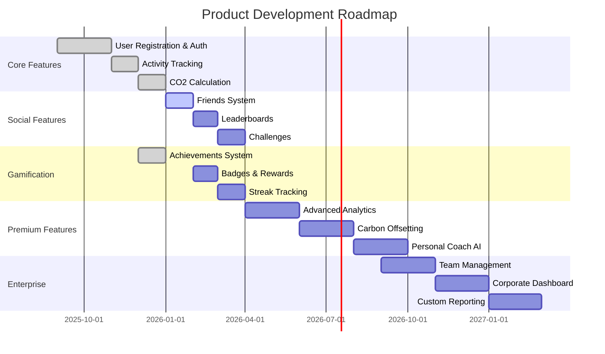

## 9. User Acquisition Funnel

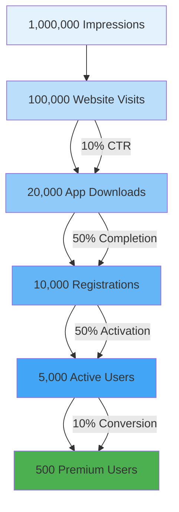

## 10. Cost Structure Breakdown

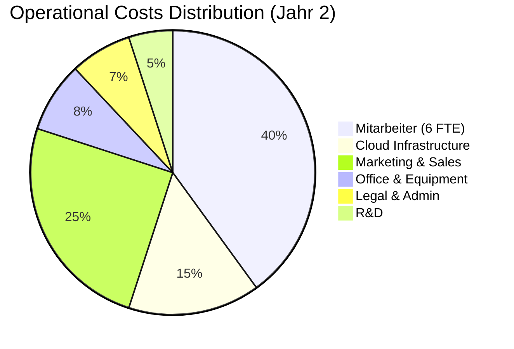

## 11. Achievement System Flow

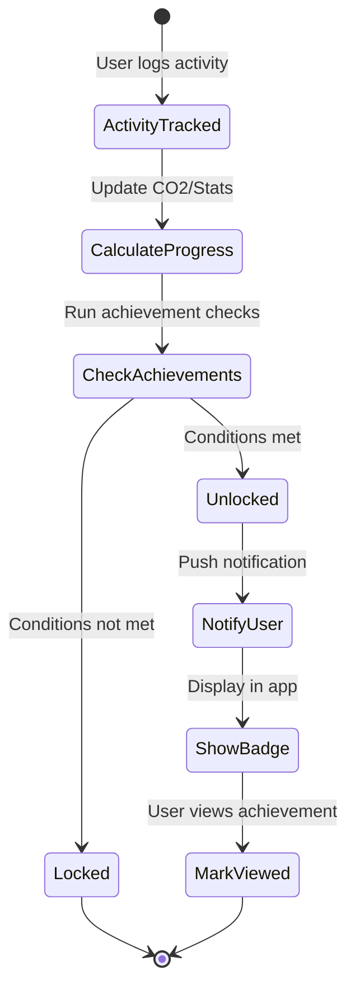

## 12. Business Model Canvas (Simplified)

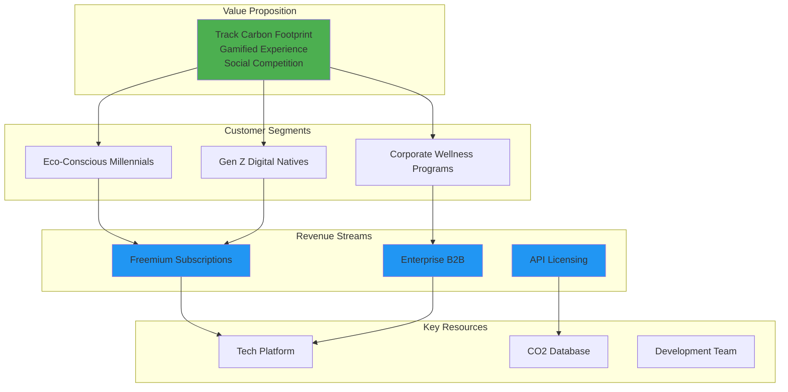

## 13. Risk Mitigation Strategy

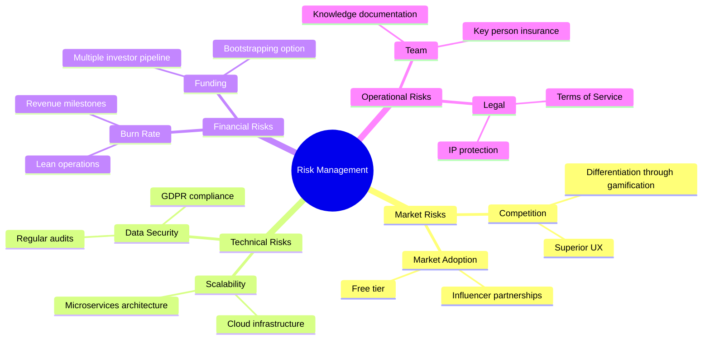

## 14. Customer Journey Map

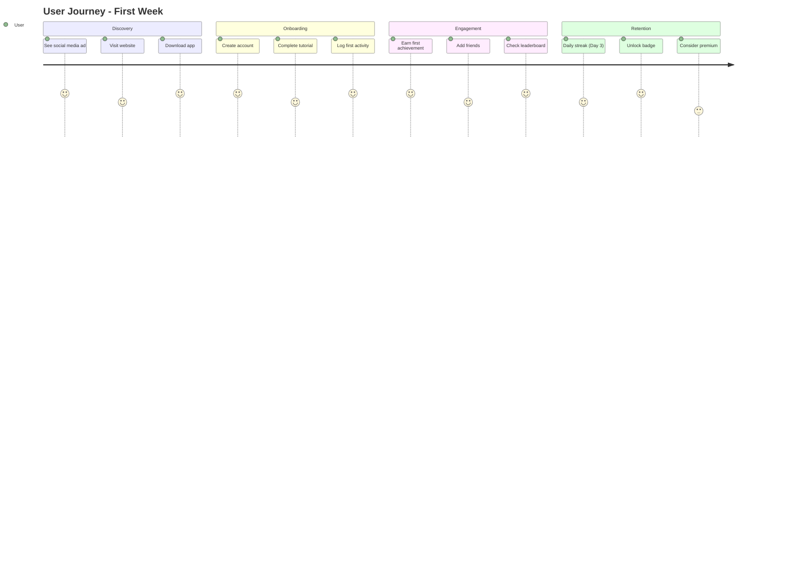

## 15. Exit Strategy Timeline

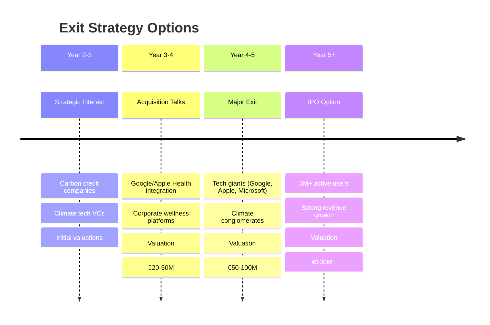

---

## Verwendung der Diagramme

Diese Mermaid-Diagramme können in folgenden Tools direkt gerendert werden:

- **GitHub/GitLab**: Automatische Darstellung in README.md
- **VS Code**: Mit Mermaid-Extension
- **Notion, Confluence**: Native Mermaid-Support
- **PowerPoint**: Export über mermaid.live
- **Präsentationen**: Screenshots oder Live-Render

**Tipp**: Öffne diese Datei in VS Code mit der Mermaid-Extension für Live-Preview!
